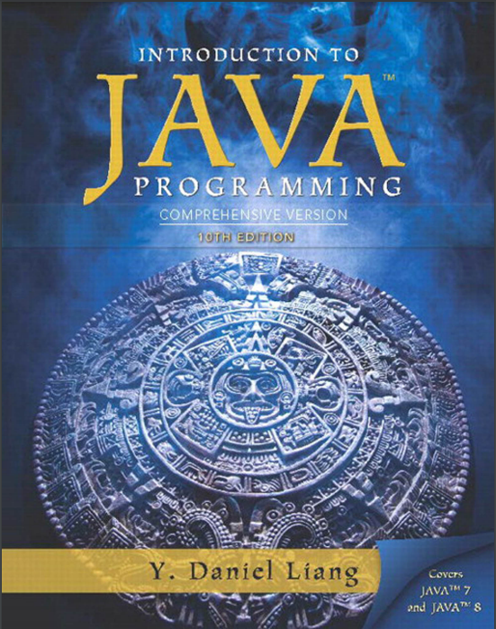

# INTRODUCTION TO JAVA PROGRAMMING 10TH EDITION  <br> _Exercise Solutions_



### This repo contains <a href="#exercise-solutions-shortcut">my solutions to the end-of-chapter exercise’s</a> from <a href="https://www.amazon.com/Intro-Java-Programming-Comprehensive-Version/dp/0133761312">Y. Daniel Liang’s Intro to Java Programming (10th Edition)</a>

### I've included links below to all the freely accessible companion material and quick links to navigate through my solutions by chapter.

### See <a href="#contribute">Contribution Guide</a> for coding guidelines and information on how to contribute.

____

#### - About the 10th Edition -

_"Daniel Liang teaches concepts of problem-solving and object-oriented programming using a fundamentals-first approach
. Beginning programmers learn critical problem-solving techniques then move on to grasp the key concepts of
object-oriented, GUI programming, advanced GUI and Web programming using Java..."_

----
<h1 style="text-align: center">Companion Content</h1>
<h6>Additional online learning material that came with the books</h6>

### <a href="https://media.pearsoncmg.com/ph/esm/ecs_liang_ijp_11/cw/#web-chapters">Bonus Chapters Online</a>

### <a href="https://liveexample.pearsoncmg.com/CheckExercise/faces/CheckExercise.xhtml?chapter=1&programName=Exercise01_01">Exercise Check Tool</a>

### <a href="https://media.pearsoncmg.com/ph/esm/ecs_liang_java_13e/cw/#videonotes">Video Notes</a>

### <a href="#self-check-quizs">Self-Check Chapter Quiz's</a>

### <a href="https://liveexample.pearsoncmg.com/javarevel2e.html">Hints to Quizzes and Programming Projects</a>

### <a href='#checkpoint-answers'>Checkpoint Answers</a>

### <a href='https://github.com/HarryDulaney/intro-to-java-programming/blob/eeaf93fe6d01d8313fcc5f420118d80ae5badd8a/resources/uml-diagrams/EvenNumberedExerciseUMLDiagram.pdf'>UML Diagrams for Chapter 9 - 13</a>

### <a href="https://media.pearsoncmg.com/ph/esm/ecs_liang_ijp_10/ExampleByChapters.html">Example Programs By Chapter</a>

### <a href="http://liveexample.pearsoncmg.com/liang/animation/animation.html">Algorithm Animations</a>

### <a href="https://media.pearsoncmg.com/ph/esm/ecs_liang_ijp_10/supplement/Supplement1dcodingguidelines.html">Java Coding Style Guidelines</a>

____

<span id="contribute"><span/>

## How to Contribute

### _Coding Guidelines_

- #### Solution must use Java 8 SE, as this is the version used by the book.
    - #### Every solution should have a java file containing a public main method for testing it.
    - #### Naming convention is: ExerciseCC_EE.java where CC is the chapter number and EE is the exercise number.
    - #### The public Exercise class containing the main method must include a JavaDoc comment on the class with original exercise question.
    - #### Each solution should be its own self-contained program with minimal dependencies on other files. If you need multiple files please create a package for the exercise.
        - #### ch_XX/exercise22_07/Exercise22_07.java
        - #### This allows us to utilize the Exercise Checking Tool [Exercise Checking Tool](https://liveexample.pearsoncmg.com/CheckExercise/faces/CheckExercise.xhtml?chapter=1&programName=Exercise01_01) to verify solutions.
- ### Example exercise solution:

```java
package ch_01;

/**
 * 1.1 (Display three messages) Write a program that displays Welcome to Java,
 * Welcome to Computer Science, and Programming is fun.
 */
public class Exercise01_01 {
    public static void main(String[] args) {
        System.out.println("Welcome to Java");
        System.out.println("Welcome to Computer Science");
        System.out.println("Programming is fun");
    }

}
```

### <em id="prs">Pull requests:</em>

- _When to use Pull Requests_
    - To add new solutions, that do not already exist.
    - To add new documentation and/or comments to existing exercise solutions.

- _How to use Pull Requests_
    1. Fork the Master branch
    2. Create a feature branch (with a descriptive name) using the fork from step 1.
    3. Make your changes to your new branch (Only commit and push the files you plan to merge).
    4. Make a Pull Request into our intro-to-java-programming Master branch.

### <em>Issue's:</em>

- _Please feel free to open new Issues._
    - To request a specific Exercise that you need answered.
        - Be sure to include the Chapter and Exercise number.
    - To request a change to an existing solution.
    - You find an error in an existing solution.

____

<h1 id="exercise-solutions-shortcut">Exercise Solutions:</h1>
<h5>Quick Links to navigate these solutions by chapter</h5>
<h6>

Indicates 100% completion of all exercises for that chapter
</h6>
<ul>
		<li><a href="https://github.com/HarryDulaney/intro-to-java-programming/tree/master/ch_01"><strong
>Chapter 1</strong></a> - Introduction to Computers, Programs, and Java 
</li>
<br>	
		<li><a href="https://github.com/HarryDulaney/intro-to-java-programming/tree/master/ch_02"><strong
>Chapter 2</strong></a> - Elementary Programming

</li><br>
		<li><a href="https://github.com/HarryDulaney/intro-to-java-programming/tree/master/ch_03"><strong
>Chapter 3</strong></a> - Selections 

 </li><br>
		<li><a href="https://github.com/HarryDulaney/intro-to-java-programming/tree/master/ch_04"><strong
>Chapter 4</strong></a> - Mathematical Functions, Characters, and Strings

</li><br>
		<li><a href="https://github.com/HarryDulaney/intro-to-java-programming/tree/master/ch_05"><strong
>Chapter 5</strong></a> - Loops 

</li><br>
		<li><a href="https://github.com/HarryDulaney/intro-to-java-programming/tree/master/ch_06"><strong
>Chapter 6</strong></a> - Methods 

</li><br>
		<li><a href="https://github.com/HarryDulaney/intro-to-java-programming/tree/master/ch_07"><strong
>Chapter 7</strong></a> - Single-Dimensional Arrays

</li><br>
		<li><a href="https://github.com/HarryDulaney/intro-to-java-programming/tree/master/ch_08"><strong
>Chapter 8</strong></a> - MultiDimensional Arrays 

</li><br>
		<li><a href="https://github.com/HarryDulaney/intro-to-java-programming/tree/master/ch_09"><strong
>Chapter 9</strong></a> - Objects and Classes

</li><br>
		<li><a href="https://github.com/HarryDulaney/intro-to-java-programming/tree/master/ch_10"><strong
>Chapter 10</strong></a> - Object-Oriented Thinking

</li><br>
		<li><a href="https://github.com/HarryDulaney/intro-to-java-programming/tree/master/ch_11"><strong
>Chapter 11</strong></a> - Inheritance and Polymorphism

</li><br>
		<li><a href="https://github.com/HarryDulaney/intro-to-java-programming/tree/master/ch_12"><strong
>Chapter 12</strong></a> - Exception Handling and Text I/O

</li><br>
		<li><a href="https://github.com/HarryDulaney/intro-to-java-programming/tree/master/ch_13"><strong
>Chapter 13</strong></a> - Abstract Classes and Interfaces 

</li><br>
		<li><a href="https://github.com/HarryDulaney/intro-to-java-programming/tree/master/ch_14"><strong>Chapter 
14</strong></a> - JavaFx Basics 
</li><br>
		<li><a href="https://github.com/HarryDulaney/intro-to-java-programming/tree/master/ch_15"><strong>Chapter 15
</strong></a> - Event-Driven Programming and Animations 

</li><br>
		<li><a href="https://github.com/HarryDulaney/intro-to-java-programming/tree/master/ch_16"><strong>Chapter
		 16</strong></a> - JavaFx UI Controls and Multimedia

<h6>
Exercises Needed: 13, 15, 17, 19, 21, 23, 25, 27, 29, 31
</h6>
</li><br>
		<li><a href="https://github.com/HarryDulaney/intro-to-java-programming/tree/master/ch_17"><strong>Chapter 
17</strong></a> - Binary I/O

</li><br>
		<li><a href="https://github.com/HarryDulaney/intro-to-java-programming/tree/master/ch_18"><strong>Chapter 18
</strong></a> - Recursion

</li><br>
		<li><a href="https://github.com/HarryDulaney/intro-to-java-programming/tree/master/ch_19"><strong>Chapter 
19</strong></a> - Generics

</li><br>
		<li><a href="https://github.com/HarryDulaney/intro-to-java-programming/tree/master/ch_20"><strong>Chapter 20
</strong></a> - Lists, Stacks, Queues, and Priority Queues

</li><br>
		<li><a href="https://github.com/HarryDulaney/intro-to-java-programming/tree/master/ch_21"><strong>Chapter 21
</strong></a> - Sets and Maps

</li><br>
		<li><a href="https://github.com/HarryDulaney/intro-to-java-programming/tree/master/ch_22"><strong>Chapter 22
</strong></a> - Developing Efficient Algorithms</li><br>
		<li><a href="https://github.com/HarryDulaney/intro-to-java-programming/tree/master/ch_23"><strong>Chapter 23
</strong></a> - Sorting</li><br>
		<li><a href="https://github.com/HarryDulaney/java-programming-daniel-liang-10th/tree/master/ch_24">
<strong>Chapter 24</strong></a> - Implementing Lists, Stacks, Queues, and Priority Queues</li><br>
		<li><a href="https://github.com/HarryDulaney/intro-to-java-programming/tree/master/ch_25"><strong>Chapter 25
</strong></a> - Binary Search Trees </li><br>
		<li><!--<a href="https://github.com/HarryDulaney/java-programming-daniel-liang-10th/tree/master/">-->
<strong>Chapter 26</strong><!--</a>--> - AVL Trees </li><br>
		<li><a href="https://github.com/HarryDulaney/java-programming-daniel-liang-10th/tree/master/ch_27">
<strong>Chapter 27</strong></a> - Hashing</li><br>
		<li><a href="https://github.com/HarryDulaney/java-programming-daniel-liang-10th/tree/master/ch_28">
<strong>Chapter 28</strong></a> - Graphs and Applications</li><br>
		<li><a href="https://github.com/HarryDulaney/java-programming-daniel-liang-10th/tree/master/ch_29">
<strong>Chapter 29</strong></a> - Weighted Graphs and Applications </li><br>
		<li><a href="https://github.com/HarryDulaney/java-programming-daniel-liang-10th/tree/master/ch_30">
<strong>Chapter 30</strong></a> - Multithreading and Parallel Programming</li><br>
		<li><a href="https://github.com/HarryDulaney/java-programming-daniel-liang-10th/tree/master/ch_31">
<strong>Chapter 31</strong></a> - Networking </li><br>
		<li><!-- <a href="https://github.com/HarryDulaney/java-programming-daniel-liang-10th/tree/master/ch_32"> -->
<strong>Chapter 32</strong><!-- </a> --> - Java Database Programming</li><br>
		<li><!--<a href="https://github.com/HarryDulaney/java-programming-daniel-liang-10th/tree/master/ch_33">-->
<strong>Chapter 33</strong><!--</a>--> - Java Server Faces</li><br>
</ul>

____

<h1 id="checkpoint-answers">Checkpoint Answers</h1>
<h6>Checkpoint Questions at the end of each chapter</h6>

##### <a href="https://liveexample.pearsoncmg.com/checkpoint/Chapter1.html">Chapter 1 Check Point Questions</a>

##### <a href="https://liveexample.pearsoncmg.com/checkpoint/Chapter2.html">Chapter 2 Check Point Questions</a>

##### <a href="https://liveexample.pearsoncmg.com/checkpoint/Chapter3.html">Chapter 3 Check Point Questions</a>

##### <a href="https://liveexample.pearsoncmg.com/checkpoint/Chapter4.html">Chapter 4 Check Point Questions</a>

##### <a href="https://liveexample.pearsoncmg.com/checkpoint/Chapter5.html">Chapter 5 Check Point Questions</a>

##### <a href="https://liveexample.pearsoncmg.com/checkpoint/Chapter6.html">Chapter 6 Check Point Questions</a>

##### <a href="https://liveexample.pearsoncmg.com/checkpoint/Chapter7.html">Chapter 7 Check Point Questions</a>

##### <a href="https://liveexample.pearsoncmg.com/checkpoint/Chapter8.html">Chapter 8 Check Point Questions</a>

##### <a href="https://liveexample.pearsoncmg.com/checkpoint/Chapter9.html">Chapter 9 Check Point Questions</a>

##### <a href="https://liveexample.pearsoncmg.com/checkpoint/Chapter10.html">Chapter 10 Check Point Questions</a>

##### <a href="https://liveexample.pearsoncmg.com/checkpoint/Chapter11.html">Chapter 11 Check Point Questions</a>

##### <a href="https://liveexample.pearsoncmg.com/checkpoint/Chapter12.html">Chapter 12 Check Point Questions</a>

##### <a href="https://liveexample.pearsoncmg.com/checkpoint/Chapter13.html">Chapter 13 Check Point Questions</a>

##### <a href="https://liveexample.pearsoncmg.com/checkpoint/Chapter14.html">Chapter 14 Check Point Questions</a>

##### <a href="https://liveexample.pearsoncmg.com/checkpoint/Chapter15.html">Chapter 15 Check Point Questions</a>

##### <a href="https://liveexample.pearsoncmg.com/checkpoint/Chapter16.html">Chapter 16 Check Point Questions</a>

##### <a href="https://liveexample.pearsoncmg.com/checkpoint/Chapter17.html">Chapter 17 Check Point Questions</a>

##### <a href="https://liveexample.pearsoncmg.com/checkpoint/Chapter18.html">Chapter 18 Check Point Questions</a>

##### <a href="https://liveexample.pearsoncmg.com/checkpoint/Chapter19.html">Chapter 19 Check Point Questions</a>

##### <a href="https://liveexample.pearsoncmg.com/checkpoint/Chapter20.html">Chapter 20 Check Point Questions</a>

##### <a href="https://liveexample.pearsoncmg.com/checkpoint/Chapter21.html">Chapter 21 Check Point Questions</a>

##### <a href="https://liveexample.pearsoncmg.com/checkpoint/Chapter22.html">Chapter 22 Check Point Questions</a>

##### <a href="https://liveexample.pearsoncmg.com/checkpoint/Chapter23.html">Chapter 23 Check Point Questions</a>

##### <a href="https://liveexample.pearsoncmg.com/checkpoint/Chapter24.html">Chapter 24 Check Point Questions</a>

##### <a href="https://liveexample.pearsoncmg.com/checkpoint/Chapter25.html">Chapter 25 Check Point Questions</a>

##### <a href="https://liveexample.pearsoncmg.com/checkpoint/Chapter26.html">Chapter 26 Check Point Questions</a>

##### <a href="https://liveexample.pearsoncmg.com/checkpoint/Chapter27.html">Chapter 27 Check Point Questions</a>

##### <a href="https://liveexample.pearsoncmg.com/checkpoint/Chapter28.html">Chapter 28 Check Point Questions</a>

##### <a href="https://liveexample.pearsoncmg.com/checkpoint/Chapter29.html">Chapter 29 Check Point Questions</a>

##### <a href="https://liveexample.pearsoncmg.com/checkpoint/Chapter30.html">Chapter 30 Check Point Questions</a>

##### <a href="https://liveexample.pearsoncmg.com/checkpoint/Chapter31.html">Chapter 31 Check Point Questions</a>

##### <a href="https://liveexample.pearsoncmg.com/checkpoint/Chapter32.html">Chapter 32 Check Point Questions</a>

##### <a href="https://liveexample.pearsoncmg.com/checkpoint/Chapter33.html">Chapter 33 Check Point Questions</a>

##### <a href="https://liveexample.pearsoncmg.com/checkpoint/Chapter34.html">Chapter 34 Check Point Questions</a>

##### <a href="https://liveexample.pearsoncmg.com/checkpoint/Chapter35.html">Chapter 35 Check Point Questions</a>

##### <a href="https://liveexample.pearsoncmg.com/checkpoint/Chapter36.html">Chapter 36 Check Point Questions</a>

##### <a href="https://liveexample.pearsoncmg.com/checkpoint/Chapter37.html">Chapter 37 Check Point Questions</a>

##### <a href="https://liveexample.pearsoncmg.com/checkpoint/Chapter38.html">Chapter 38 Check Point Questions</a>

##### <a href="https://liveexample.pearsoncmg.com/checkpoint/Chapter39.html">Chapter 39 Check Point Questions</a>

##### <a href="https://liveexample.pearsoncmg.com/checkpoint/Chapter40.html">Chapter 40 Check Point Questions</a>

##### <a href="https://liveexample.pearsoncmg.com/checkpoint/Chapter41.html">Chapter 41 Check Point Questions</a>

##### <a href="https://liveexample.pearsoncmg.com/checkpoint/Chapter42.html">Chapter 42 Check Point Questions</a>

##### <a href="https://liveexample.pearsoncmg.com/checkpoint/Chapter43.html">Chapter 43 Check Point Questions</a>

##### <a href="https://liveexample.pearsoncmg.com/checkpoint/Chapter44.html">Chapter 44 Check Point Questions</a>

##### <a href="https://liveexample.pearsoncmg.com/checkpoint/Chapter45.html">Chapter 45 Check Point Questions</a>

____

<h1 id="self-check-quizs">Self-Check Quiz's</h1>
<h6>Self-Check Quiz's are provided for self testing and reinforcing what you leaned in the chapter</h6>

##### <a href="https://liveexample-ppe.pearsoncmg.com/selftest/selftestapcs?chapter=1&username=liangapcs">Chapter 1 Self-Check Quiz</a>

##### <a href="https://liveexample-ppe.pearsoncmg.com/selftest/selftestapcs?chapter=2&username=liangapcs">Chapter 2 Self-Check Quiz</a>

##### <a href="https://liveexample-ppe.pearsoncmg.com/selftest/selftestapcs?chapter=3&username=liangapcs">Chapter 3 Self-Check Quiz</a>

##### <a href="https://liveexample-ppe.pearsoncmg.com/selftest/selftestapcs?chapter=4&username=liangapcs">Chapter 4 Self-Check Quiz</a>

##### <a href="https://liveexample-ppe.pearsoncmg.com/selftest/selftestapcs?chapter=5&username=liangapcs">Chapter 5 Self-Check Quiz</a>

##### <a href="https://liveexample-ppe.pearsoncmg.com/selftest/selftestapcs?chapter=6&username=liangapcs">Chapter 6 Self-Check Quiz</a>

##### <a href="https://liveexample-ppe.pearsoncmg.com/selftest/selftestapcs?chapter=7&username=liangapcs">Chapter 7 Self-Check Quiz</a>

##### <a href="https://liveexample-ppe.pearsoncmg.com/selftest/selftestapcs?chapter=8&username=liangapcs">Chapter 8 Self-Check Quiz</a>

##### <a href="https://liveexample-ppe.pearsoncmg.com/selftest/selftestapcs?chapter=9&username=liangapcs">Chapter 9 Self-Check Quiz</a>

##### <a href="https://liveexample-ppe.pearsoncmg.com/selftest/selftestapcs?chapter=10&username=liangapcs">Chapter 10 Self-Check Quiz</a>

##### <a href="https://liveexample-ppe.pearsoncmg.com/selftest/selftestapcs?chapter=11&username=liangapcs">Chapter 11 Self-Check Quiz</a>

##### <a href="https://liveexample-ppe.pearsoncmg.com/selftest/selftestapcs?chapter=12&username=liangapcs">Chapter 12 Self-Check Quiz</a>

##### <a href="https://liveexample-ppe.pearsoncmg.com/selftest/selftestapcs?chapter=13&username=liangapcs">Chapter 13 Self-Check Quiz</a>

##### <a href="https://liveexample-ppe.pearsoncmg.com/selftest/selftestapcs?chapter=14&username=liangapcs">Chapter 14 Self-Check Quiz</a>

____